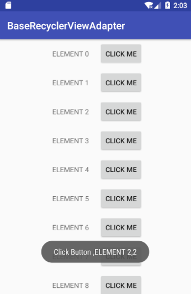

BaseRecyclerViewAdapter
=========
一个基于Databinding的RecyclerViewAdapter



## How to use

### layout:
```xml
<!-- view_item.xml -->
<LinearLayout xmlns:android="http://schemas.android.com/apk/res/android"
    android:layout_width="match_parent"
    android:layout_height="wrap_content"
    android:orientation="horizontal"
    android:gravity="center"
    android:padding="5dp">

    <TextView
        android:id="@+id/text_view"
        android:layout_width="wrap_content"
        android:layout_height="wrap_content"
        android:padding="10dp"
        android:gravity="center"/>

    <Button
        android:id="@+id/button"
        android:layout_width="wrap_content"
        android:layout_height="wrap_content"
        android:layout_marginLeft="10dp"
        android:text="CLICK ME"
        android:padding="10dp"
        android:gravity="center"/>

</LinearLayout>
```

### Adapter:
```java
public class MyAdapter extends BaseRecyclerViewAdapter<ViewItemBinding, String> {

    public MyAdapter(List<String> list) {
        super(R.layout.view_item, list);
    }

    @Override
    public void onBaseBindViewHolder(@NonNull ViewItemBinding binding, String s, int i) {
        //初始化内容
        binding.textView.setText(s);

        //设置点击事件
        setOnClick(binding.button, i);
    }
}
```

### Activity:
```java
public class MainActivity extends AppCompatActivity {

    ActivityMainBinding binding;
    List<String> list;
    MyAdapter adapter;

    @Override
    protected void onCreate(Bundle savedInstanceState) {
        super.onCreate(savedInstanceState);

        binding = DataBindingUtil.setContentView(this, R.layout.activity_main);
        binding.recyclerView.setLayoutManager(new LinearLayoutManager(this));

        initData();
        initAdapter();
    }

    void initData() {
        list = new ArrayList<>();
        for (int i=0; i<20; i++) {
            list.add("ELEMENT " + i);
        }
    }

    void initAdapter() {
        adapter = new MyAdapter(list);
        binding.recyclerView.setAdapter(adapter);
        adapter.setOnClickListener(new BaseRecyclerViewAdapter.OnViewClickListener<String>() {
            @Override
            public void onClick(View v, String s, int i) {
                switch (v.getId()) {
                    case R.id.button:
                        showToast("Click Button ," + s + "," + i);
                        break;
                }
            }
        });
    }

    Toast toast;
    void showToast(String s) {
        if (toast != null) {
            toast.cancel();
        }
        toast = Toast.makeText(MainActivity.this, s, Toast.LENGTH_SHORT);
        toast.show();
    }
}
```

License
=======

    Copyright 2018 LVinnie

    Licensed under the Apache License, Version 2.0 (the "License");
    you may not use this file except in compliance with the License.
    You may obtain a copy of the License at

       http://www.apache.org/licenses/LICENSE-2.0

    Unless required by applicable law or agreed to in writing, software
    distributed under the License is distributed on an "AS IS" BASIS,
    WITHOUT WARRANTIES OR CONDITIONS OF ANY KIND, either express or implied.
    See the License for the specific language governing permissions and
    limitations under the License.


[](https://android-arsenal.com/details/1/1433)
